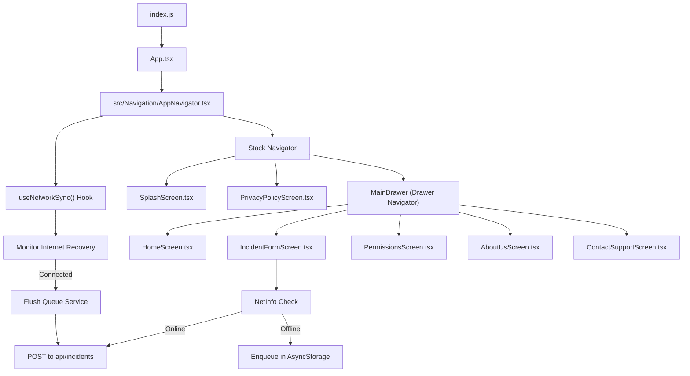
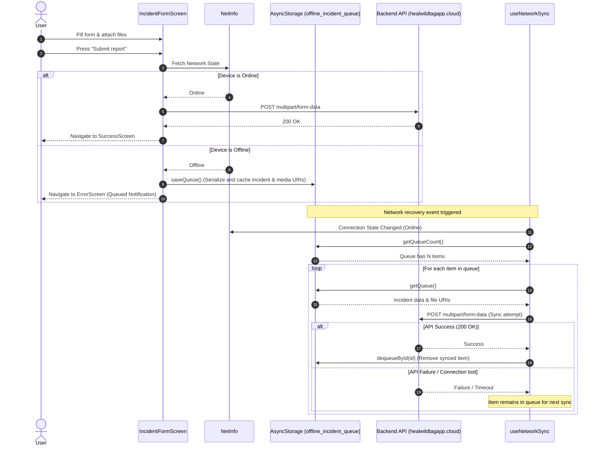
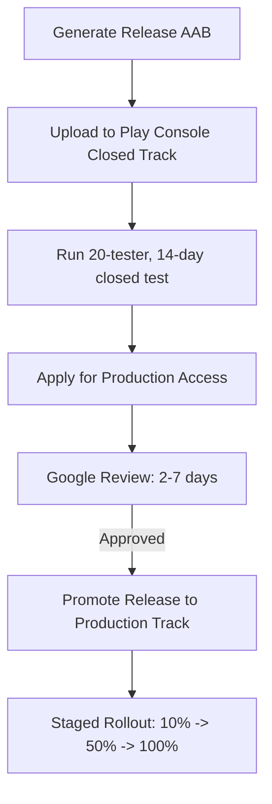

# Project Documentation & Release Guide

This document provides a comprehensive overview of the **WildTag** (Heal) mobile application. It is designed to help new developers, testers, and administrators quickly understand the application's architecture, code structure, component interactions, end-to-end workflows, third-party integrations, environment setup, and release procedures.

---

## 1. Application Overview

**WildTag** is an offline-first React Native mobile application designed to report and monitor wildlife incidents. It allows field agents or members of the public to capture and log incident reports with descriptions, categories, geolocation, and media attachments (photos and audio recordings).

### Core Features
- **Offline-First Submission**: Incidents can be compiled and submitted without an active internet connection. If offline, reports are queued locally and automatically synchronized with the server when connectivity is restored.
- **Auto-detected Geolocation**: Utilizes GPS hardware to lock in coordinates where the incident occurs.
- **Media Attachments**: Supports picking and uploading multiple photos and audio files.
- **Permissions Management**: Provides users with a dedicated settings menu to manage Camera, Location, and Notification permissions.
- **First-Time User Consent**: Enforces a privacy policy review and bulk permission requests during the initial launch.

---

## 2. Overall Application Architecture & Navigation Flow

The mobile client is built on **React Native (v0.84.0)**, connecting to a backend server hosted on an EC2 instance. It utilizes localized async storage for queues, network monitors to schedule synchronization, and native interfaces for device hardware interaction.

### System Architecture Diagram



### Component Interaction Diagram



---

## 3. Code Structure & Module Overview

The project follows a standard React Native codebase structure. Code written for application flows resides in the `src` directory, separating screens, navigation, hooks, and services.

```
Heal/
├── android/                   # Native Android project configuration & scripts
├── ios/                       # Native iOS project configuration & pods
├── src/                       # Application Source Code
│   ├── Assets/                # SVG graphics and static assets (Splash, Report)
│   ├── Navigation/            # Navigation structure and route typings
│   ├── Screens/               # Visual UI screens
│   ├── hooks/                 # Custom global React hooks
│   └── services/              # Logic modules (offline storage, APIs)
├── App.tsx                    # React App entry & root provider wrapper
├── app.json                   # Mobile application metadata
├── index.js                   # Application entry point registered with AppRegistry
├── package.json               # Package dependencies & run scripts
└── tsconfig.json              # TypeScript configuration
```

### Module Breakdown

| Directory/File | File Name | Purpose / Responsibility |
| :--- | :--- | :--- |
| **`src/Navigation`** | `AppNavigator.tsx` | Setup Stack and Drawer navigators; checks first-time launch status; mounts network sync listener hook. |
| **`src/Screens`** | `SplashScreen.tsx` | Two-phase entrance screen with Reanimated transition; routes first-time users to `PrivacyPolicyScreen` or returning users to `MainDrawer`. |
| | `PrivacyPolicyScreen.tsx` | Explains data collection (phone, photos, GPS) and requests batch permissions (Camera, Location, Notifications) at first install. |
| | `HomeScreen.tsx` | App dashboard showing entry buttons and incident reporting cards. |
| | `IncidentFormScreen.tsx` | Form screen capturing Name, Phone, GPS, Category, Subcategory, Details, and Media Attachments. Implements offline queue fallback. |
| | `PermissionsScreen.tsx` | Settings screen displaying Switches to toggle Camera, Location, and Notifications, linking to System Settings if blocked. |
| | `AboutUsScreen.tsx` | Informational screen displaying project description. |
| | `ContactSupportScreen.tsx` | Form interface for users to report app feedback or request assistance. |
| | `SuccessScreen.tsx` | Confirmation screen shown upon successful, live incident uploads. |
| | `ErrorScreen.tsx` | Confirmation screen shown when an incident is queued locally due to lack of network. |
| | `IncidentListScreen.tsx` | *Legacy/Future screen*: Intended to list incident status from the API. Currently unregistered. |
| | `MyDataScreen.tsx` | *Legacy/Future screen*: User GDPR interface to request data export or deletion. Currently unregistered. |
| **`src/hooks`** | `useNetworkSync.ts` | React Hook listening to `NetInfo` events; coordinates auto-flush of cached records as soon as internet is reachable. |
| **`src/services`** | `offlineQueue.ts` | Queue helper reading/writing to `AsyncStorage` using a JSON serialization system. |

---

## 4. End-to-End Application Workflow

### First-Time App Launch & Onboarding
1. The user opens the app; `AppNavigator` checks `AsyncStorage` for the key `privacyPolicyAccepted`.
2. Since it is empty (first launch), the user lands on the **Splash Screen** (`SplashScreen`).
3. Pressing **Get Started** navigates to the **Privacy Policy Screen** (`PrivacyPolicyScreen`).
4. Pressing **I agree** triggers a request to prompt the user for **Camera**, **Location**, and **Notification** permissions. Once responded, the key `privacyPolicyAccepted` is set to `'true'` in `AsyncStorage`.
5. The navigator automatically shifts the user to the **MainDrawer** navigation stack.

### Incident Reporting Form Flow
1. The user goes to the **Report Incident Screen** (`IncidentFormScreen`).
2. The form automatically detects the current date/time.
3. The app executes a background `GET` fetch request to `https://healwildtagapp.cloud/api/categories/` to retrieve the current category choices.
4. If the user checks **"Are you in the location?"**, `react-native-geolocation-service` queries the GPS hardware to retrieve the lat/long coordinates. If unchecked, the user can type the location manually.
5. The user can attach multiple photos (JPEG/PNG) and an audio file (MP3/WAV/AAC) using the picker.
6. The user clicks **Submit report**:
   - The app evaluates network conditions.
   - **If Online**: Builds a multi-part payload (`FormData`) containing JSON metadata and binary file binaries, then sends it via HTTP POST to `https://healwildtagapp.cloud/api/incidents/`.
     - *Response 200 OK*: Redirects user to `SuccessScreen`.
   - **If Offline / Server Unreachable**: Calls `enqueueIncident` to serialize the record and local file paths to `AsyncStorage` under `'offline_incident_queue'`.
     - Redirects user to `ErrorScreen` advising them their post has been queued and will sync later.

### Offline Background Sync
1. The `useNetworkSync` hook monitors the NetInfo state continuously.
2. When the state shifts to online, it verifies if there are entries in the offline queue.
3. If entries exist, it serializes them one by one, building new `FormData` payloads.
4. A POST request is sent to the server. If successful, the item is removed from storage. If it fails, the sync process skips the item, leaving it for the next network transition.

---

## 5. Third-Party Integrations & Dependencies

WildTag relies on several native modules and libraries. The primary integrations are:

- **State & Local Storage**:
  - `@react-native-async-storage/async-storage`: Used for caching offline queues and tracking onboarding preferences.
- **Hardware & Geolocation**:
  - `react-native-geolocation-service`: Interfaces with native GPS chips on iOS and Android to get accurate lat/long coordinates.
- **Storage & Media Access**:
  - `@react-native-documents/picker`: Used to open the OS file chooser to upload images and audio clips.
- **Network Status**:
  - `@react-native-community/netinfo`: Monitors offline/online transitions to pause or trigger synchronization workflows.
- **Date & Calendar**:
  - `react-native-date-picker`: A native date-time scroll picker component.
- **Visuals & Layout**:
  - `react-native-reanimated` & `react-native-gesture-handler`: Drives physics-based onboarding animations.
  - `react-native-svg` & `react-native-svg-transformer`: Facilitates rendering vector icons and diagrams directly as React components.

---

## 6. Environment Setup & Configuration Details

### Prerequisites
- **Node.js**: `v22.11.0` or higher.
- **Yarn** or **npm**.
- **Android SDK**: Compile SDK 36, Target SDK 36, Build Tools 36.0.0, NDK 27.1.12297006.
- **Xcode & CocoaPods** (Required for iOS builds on macOS).

### Local Setup
1. **Clone the repository** and navigate to the project directory:
   ```bash
   cd Heal
   ```
2. **Install Dependencies**:
   ```bash
   yarn install
   # or
   npm install
   ```
3. **Run Metro Bundler**:
   ```bash
   yarn start
   # or
   npm start
   ```

### Running on Emulator/Device
- **Android**:
  Make sure an Android Emulator is running or an active device is connected via ADB.
  ```bash
  yarn android
  # or
  npm run android
  ```
- **iOS**:
  Navigate to the `ios` folder to install CocoaPods dependencies, then launch the runner:
  ```bash
  cd ios
  bundle install
  bundle exec pod install
  cd ..
  yarn ios
  # or
  npm run ios
  ```

### API endpoints Config
The application points directly to the backend domain:
- **Production Host**: `https://healwildtagapp.cloud`
- **End-points**:
  - Fetch Incident Categories: `GET /api/categories/`
  - Submit Incidents: `POST /api/incidents/`

---

## 7. Android Deployment & Release Process

The app utilizes standard Gradle build configurations located in `android/app/build.gradle`.

### Current Release Status
- **Application ID**: `com.wildtag.healearth`
- **Current Version Name**: `1.0.0`
- **Current Version Code**: `5`
- **Build Configuration**: Configured with a dedicated `release.keystore` key signing block.
- **ABI Split Note**: The `build.gradle` has `splits { abi { include "arm64-v8a" } }` enabled to generate a smaller file footprint during testing.
  > [!IMPORTANT]
  > Before rolling out to final production, ensure you build an **Android App Bundle (.aab)** using `bundleRelease` instead of splitting APKs. The Play Store will automatically optimize and deliver custom APK splits to end-user devices for all target architectures.

### The 14-Day Closed Testing Requirement
Google Play Console enforces a mandatory testing phase for personal developer accounts created after November 2023:
1. **Tester Requirement**: You must recruit at least **20 testers** who opt-in to your closed test.
2. **Engagement Duration**: The 20 testers must keep the app installed and remain opted-in for **14 days continuously**.
3. **Activity**: Google tracks tester activity. It is critical that testers open the app regularly and generate mock reports during this period.

### Responsibilities of the Play Console Admin
- **Tester Registration**: Collect tester Google Accounts (emails), create a Tester List in Play Console, and send them the Web opt-in link or Android download link.
- **Engagement Oversight**: Check the Play Console dashboard periodically to verify the number of opted-in testers and monitor their active days.
- **Store Listing & Ratings**: Ensure the store listing (description, screenshots, icon, feature graphic) is complete. Complete target audience questionnaires, privacy policy declarations, and content ratings.
- **Production Application**: Once the 14 days elapse, click **Apply for production** on the Play Console dashboard.
  - *Admin Task*: Complete the application questionnaire describing how testers were recruited, feedback received, and fixes applied.

### Production Rollout & Approval Steps


1. **Promote Release**: In the Play Console, navigate to **Closed testing**, choose the active release, and click **Promote release** > **Production**.
2. **Review & Release**: Set up a **Staged Rollout** (e.g., 10%) to limit risk.
3. **Submit for Review**: Send the release to Google for review. (Reviews typically take 2–5 business days).
4. **Gradual Rollout**: Increase the rollout percentage (10% -> 20% -> 50% -> 100%) as stability metrics prove solid.

### Post-Release Monitoring & Validation Checklist
- [ ] **Google Play Vitals**: Check the *Crashes and ANRs* dashboard daily to catch native crashes on specific Android configurations.
- [ ] **Backend API Logs**: Monitor the API gateway (`healwildtagapp.cloud`) to verify that multipart payloads are resolving with `200 OK` statuses.
- [ ] **Tester Feedback / User Reviews**: Monitor new reviews in the Play Console to check for usability complaints or localized errors.
- [ ] **First-Time Launch Tests**: Install the production app on a clean device to ensure that the privacy policy overlay triggers and permissions prompt correctly.
- [ ] **Offline Sync Validation**: Run the app in airplane mode, submit an incident, turn off airplane mode, and verify that the sync service successfully uploads the report to the database.
